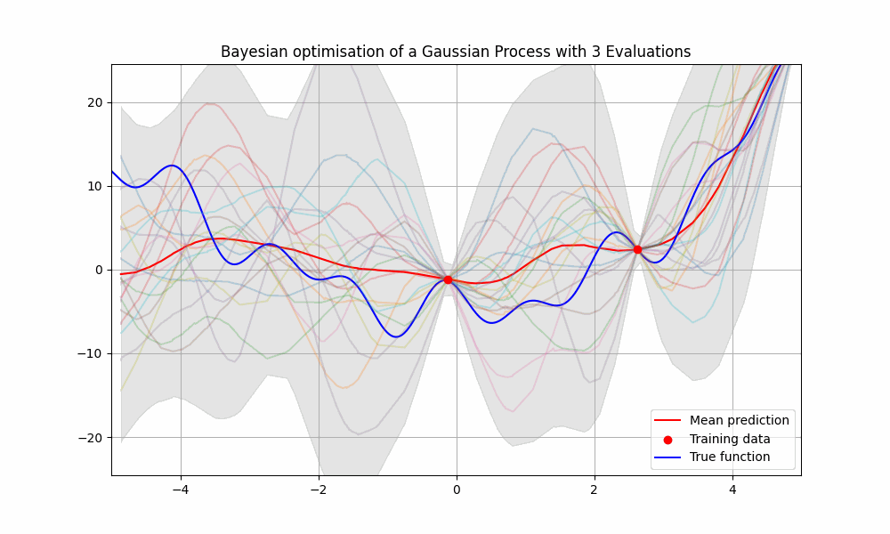

# Bayesian Optimisation of a Gaussian process


# Quick Start
To run this API, first clone this repository to your local machine:
```
git clone https://github.com/cja119/BayesianOptimisation.git
```
Then install the necessary dependencies:
```
pip install -r dependencies.txt
```
Finally, run the API:
```
streamlit run bayesian_optimisation.py
```
\[
A \cdot \sin(B \cdot X - C) + D \cdot \cos(E \cdot X) - F + G \cdot X^2 - H \cdot (\exp(-X) - \exp(X))
\]